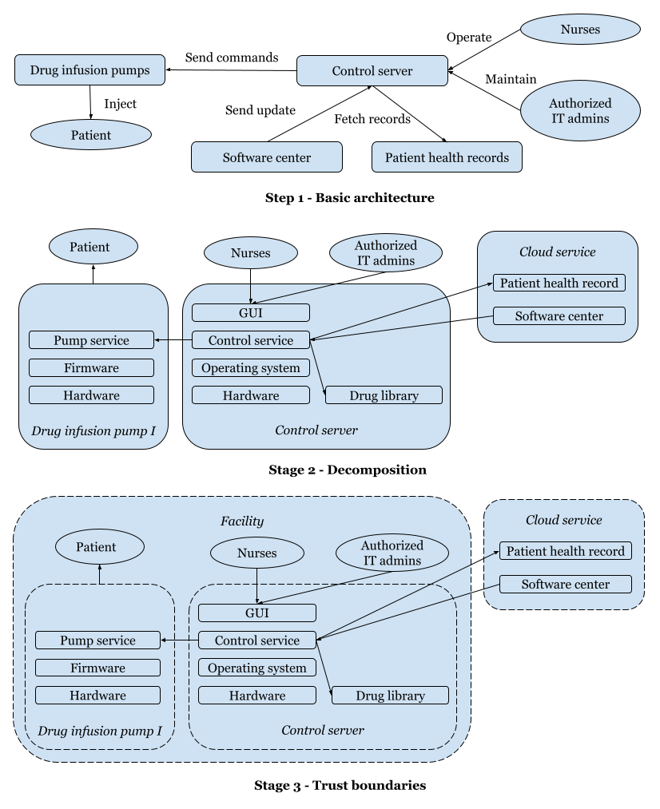

# Stage 1: Planning

## 1.1 Scoping

- Web attack surface
- White-box
- In lab environment

## 1.2 Information gathering

### **Interaction:**

- The `control server` is designed for the `medical team (nurses)` to operate the `infusion pump` remotely.
- The `kiosk app` contains a graphical user interface (GUI) that is the front-end of the control server service.
- The service sends commands to the infusion pumps that are transmitted through an `encrypted protocol`.

### **Functionalties:**

- The kiosk is not designed to use the device’s OS as a standard OS user but only the GUI app from the touch screen.
- `Vendor techicians'` can access the wole device remotly for maintanence purposes.
- GUI app has very limited interactions with the underlying OS, and the input capability is fairly restricted. 
- `Patients` are not supposed to be a user of the infusion pump due to safety reasons. 

## 1.3 Enumeration

- Web port: 8888/TCP
- No banner
- No version information
- No crawling

---

# Stage 2: Threat modeling (template)

## 2.1 Attack surface mapping

- Attack surface: Web application (GUI) 

## 2.2 Vulnerability analysis

- No vulnerability data

## 2.3 Risk scoring

### Formulation

- Risk score = (Impact + Coverage + Simpilicity*3) / 5
- Risk score > 2.5 -> Severity = High
- Risk score < 2 -> Severity = Low
- Otherwise -> Severity = Medium

### Defult impcat values

- Remote code execution = 3
- Authentication bypass = 2
- Weak authentication / authorization = 2
- Tampering = 2
- Privilege escalation = 2
- Information disclosure = 1 
- Denial of service = 1  
- Repudiation = 1

---

# Threats

#### 1. Authentication - Weak credentials

- The GUI authenticates users with four-digit PINs that can be predicted. 
- **Impact:** If attackers bypass authentication, they can send commands to the infusion pump on behalf of the accounts’ owners.
- **Category:** Spoofing
- **Risk score:**
  - Impact: Authentication bypass (2)
  - Coverage: One attack affecting all users (3)
  - Simplicity: Easy to build the password list (3)
  - (2 + 3 + 3*3) / 5 > 2.5
- **Severity:** High

#### 2. Authentication - Improper account lockout

- The GUI locks a user out after five consecutive failed login attempts.
- Although it is supposed to be a brute-force protection mechanism, it can cause not to log into the system for a specified period. 
- Since the system works with a single user account, it blocks all users. 
- **Impact:** It might block access to the system and violate the patient safety requirement. Need to find the balance between security, safety, and usability.
- **Category:** Denial of service
- **Risk score:**
  - Impact: Denial of service (1)
  - Coverage: One attack affecting all users (3)
  - Simplicity: easy to reach lockout (3)
  - (1 + 3 + 3*3) / 5 > 2.5
- **Severity:** High

#### 3. Authentication - Weak mechanism

- The GUI logs user actions; however, it supports only a single user account for the nurses. 
- **Impact:** It is impossible to distinguish users between them and identify actual users of a specific operation.
- **Category:** Repudiation
- **Risk score:** 
  - Impact: Repudiation (1)
  - Coverage: One user/system user (1)
  - Simplicty: Default behavior (3)
  - (1 + 1 + 3*3) / 5 > 2
- **Severity:** Medium

#### 4. Supply chain attack

- Critical medical systems frequently have remote support solutions that allow the vendor’s technicians to access the software instantly. 
- Even if remote connection also requires authentication, the credentials might be publicly available or be the default.
- **Impact:** As technician accounts are more privileged on the device, it can be misused to escalate privileges.
- **Category:** Privilege escalation
- **Risk score:**
  - Impact: Privilege escalation (2)
  - Coverage: One user/system user (2)
  - Simplicity: Hard to get credentials (1)
  - (2 + 2 + 1*3) / 5 < 2
- **Severity:** Low

#### 5. Error messages

- When presented to the user, certain debugging messages or errors might reveal important information about the patients or system internals. 
- Commonly, such devices usually run outdated utilities, so such services are prone to vulnerabilities. 
- **Impact:** Adversaries might be able to decode these messages, identify the underlying technologies, and figure out ways to exploit them.
- **Category:** Information disclosure
- **Risk score:** 
  - Impact: Sensitive data disclosure (1)
  - Coverage: No user (1)
  - Simplicity: Exposed information needs manual interpretation (1) 
  - (1 + 1 + 1*3) / 5 < 2
- **Severity:** Low

#### 6. Physical tampering

- Although the GUI is designed to allow limited inputs, it could get input through an external keyboard.
- Even if most of the keyboard keys have been disabled, the system might still allow key combinations, such as shortcuts, hotkeys, or even accessibility features configured by the OS (closing a window by pressing ALT-F4 on Windows or CTRL-TAB for switching apps). 
- **Impact:** These could allow attackers to bypass the GUI and exit the kiosk app that exposes another attack surface firmware.
- **Category:** Tampering
- - **Risk score:** 
  - Impact: Tampering (2)
  - Coverage: No user (1)
  - Simplicity: Easy to do, but low probability of success (2) 
  - (2 + 1 + 2*3) / 5 < 2
- **Severity:** Low
